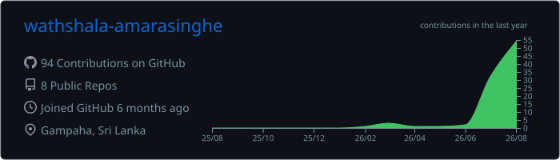
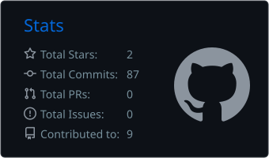
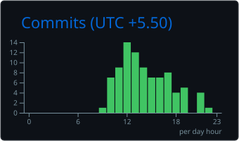
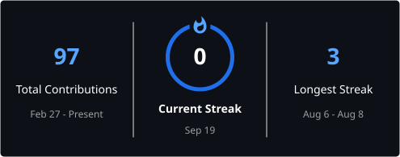

# Hi, I'm Wathshala Amarasinghe 👋

### UI/UX Designer | Software Engineering Graduate

I design clear, accessible and user-friendly digital products by combining  
user research, interface design and practical software-engineering knowledge.

  
  
  

---

## 👩‍💻 About Me

- 🎓 BSc (Hons) in Software Engineering graduate from Plymouth University, United Kingdom.
- 🎨 UI/UX Designer experienced in designing user-friendly web and mobile applications.
- 🏥 Contributed to healthcare products, including EMR and Hospital Information System workflows.
- 💳 Designed financial dashboards, transaction flows, analytics views and administrative interfaces.
- 🔍 Experienced in user research, usability testing, user flows, wireframing and prototyping.
- ♿ Interested in accessibility-focused and inclusive digital experiences.
- 💻 Comfortable collaborating with developers using practical frontend and software-engineering knowledge.
- 🌱 Currently strengthening my product-design, design-system, Next.js and frontend-development skills.
- 💼 Open to UI/UX Designer, Product Designer and related associate-level opportunities.
- 📍 Based in Sri Lanka.

---

## 💼 Professional Experience

Over one year of combined experience in UI/UX design, frontend development and software engineering.

### Associate Software Engineer

**Medi Connect Pvt Ltd**  
*July 2026 – Present*

- Develop and improve healthcare software features.
- Translate requirements into interfaces, test functionality and resolve issues.

### Associate UI/UX Developer

**Tech Connect Global (Pvt) Ltd**  
*January 2026 – June 2026*

- Designed and developed corporate and healthcare websites.
- Worked with Next.js, React, TypeScript, Tailwind CSS and Vite.

### UI/UX Designer Intern

**Tech Connect Global (Pvt) Ltd**  
*July 2025 – December 2025*

- Designed EMR, HIS and personal-finance application interfaces.
- Created user flows, wireframes and prototypes while supporting usability and accessibility.

---

## 🎯 UI/UX Capabilities

---

## 🎨 Design and Collaboration Tools

---

## 💻 Technology Stack

### Frontend and Portfolio Development

### Backend and Databases

### Development and Deployment

---

## 🚀 Featured Portfolio

### Wathshala Amarasinghe Portfolio

A modern and responsive portfolio showcasing my UI/UX case studies, software projects, professional experience and technical background.

**Technology:** Next.js, TypeScript, Tailwind CSS, GSAP, MDX, Nodemailer and Vercel.

  
  

---

## 📂 Selected Projects

### 🎵 Fully Automated Event Management System

A responsive event-management application that allows event creators to book venues, assign tasks and manage participants. It includes role-based access for administrators, band owners and event managers.

**Technology:** HTML, CSS, JavaScript, PHP and MySQL

### 🖥️ Online Computer Parts Shop Planning

Managed the planning lifecycle of an e-commerce website, including requirements, user journeys, wireframes, project milestones, budget planning and technical recommendations.

**Tools:** Figma, Trello, Google Docs and Google Sheets

### 🏠 Campus Students' Accommodation Finder

A property-listing application that helps students find nearby boarding places and hostel rooms through search, registration and booking functionality.

**Technology:** HTML, CSS, JavaScript, PHP and MySQL

### 🎁 Online Gift Shop

An e-commerce application featuring customer authentication, a shopping cart, order placement and an administrative dashboard.

**Technology:** MongoDB, Express.js, React and Node.js

### 🛒 Green Supermarket Management System

A desktop inventory and billing system featuring product management, sales tracking, secure login, database backups and transaction logs.

**Technology:** Java and MySQL

---

## 📊 GitHub Statistics

  

  
  

### 🔥 Contribution Streak

  

---

## 👩‍💻 Programming, Markup and Query Languages

The following languages represent my professional, academic and independent project experience—not only the code currently available in my public repositories.

### Currently Detected in Public Repositories

---

## 🤝 Let's Connect

I am interested in opportunities where I can contribute to user research, interface design, design systems and user-centred digital products while continuing to strengthen my technical knowledge.

- 🌐 [Portfolio Website](https://wathshala-amarasinghe-portfolio.vercel.app)
- 💼 [LinkedIn](https://www.linkedin.com/in/wathshala-amarasinghe/)
- 💻 [GitHub](https://github.com/wathshala-amarasinghe)
- 📧 [wathshaladulashan@outlook.com](mailto:wathshaladulashan@outlook.com)

### Thanks for visiting my profile! ✨

