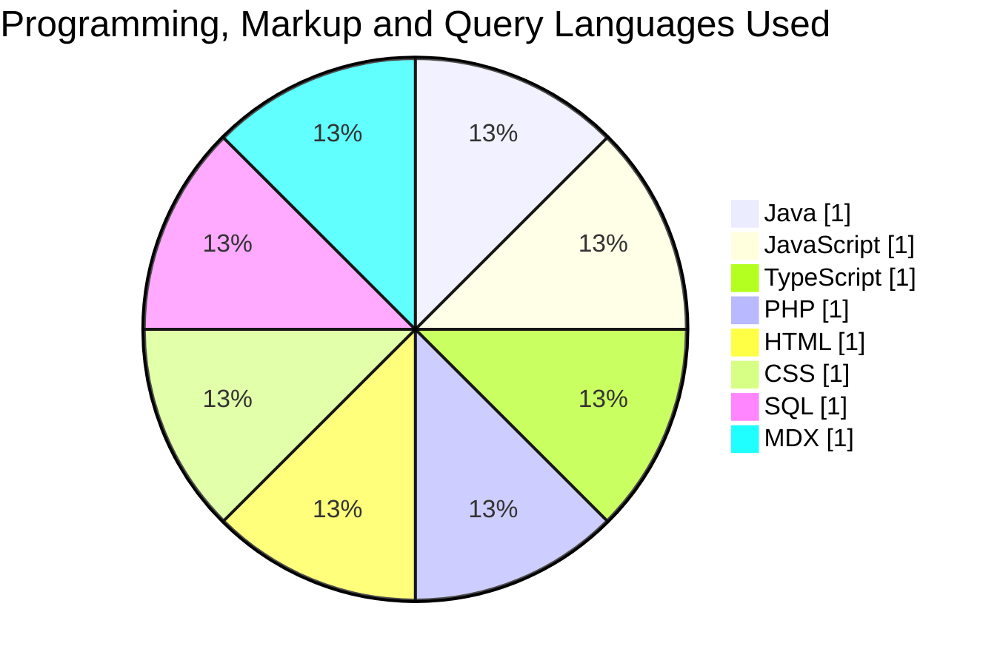

# Hi, I'm Wathshala Amarasinghe 👋

### UI/UX Designer · Associate Software Engineer

I create clear, accessible digital experiences and turn product requirements into practical software solutions.

  
  
  

---

## 👩‍💻 About Me

- BSc (Hons) in Software Engineering graduate from Plymouth University.
- Over one year of experience across UI/UX design, frontend development and software engineering.
- Experienced in healthcare systems, financial applications and responsive web products.
- Skilled in user research, wireframing, prototyping, design systems and developer collaboration.
- Based in Sri Lanka and open to UI/UX, product-design and software opportunities.

---

## 💼 Experience

### Associate Software Engineer
**Medi Connect Pvt Ltd** · *July 2026 – Present*  
Developing healthcare software, translating requirements and improving frontend usability.

### Associate UI/UX Developer
**Tech Connect Global (Pvt) Ltd** · *January 2026 – June 2026*  
Designed and developed corporate and healthcare websites using modern frontend technologies.

### UI/UX Designer Intern
**Tech Connect Global (Pvt) Ltd** · *July 2025 – December 2025*  
Designed EMR, HIS and financial-product interfaces, from research to developer handover.

---

## 🛠️ Core Skills

**UI/UX:** User Research · User Flows · Wireframing · Prototyping · Usability Testing · Design Systems · Accessibility

**Frontend:** HTML · CSS · JavaScript · TypeScript · React · Next.js · Tailwind CSS · Bootstrap

**Backend & Data:** Node.js · Express.js · PHP · Java · MySQL · MongoDB

**Tools:** Figma · Adobe XD · Miro · GitHub · Postman · Docker · Trello · Vercel

  
  
  
  
  
  
  
  

---

## 🚀 Selected Work

| Project | Focus | Technology |
|---|---|---|
| [Personal Portfolio](https://wathshala-amarasinghe-portfolio.vercel.app) | UI/UX case studies and professional profile | Next.js, TypeScript, Tailwind CSS, GSAP, MDX |
| [KAVON.net](https://kavon-net-official.vercel.app) · [Repository](https://github.com/wathshala-amarasinghe/kavon.net) | Full-stack streetwear store with storefront, admin dashboard, checkout and account verification | Next.js, React, TypeScript, Express.js, MongoDB, Tailwind CSS, Cloudinary |
| [KAVON Stock Sheet](https://kavon-stock-sheet.vercel.app) · [Repository](https://github.com/wathshala-amarasinghe/kavon-stock-sheet) | Internal stock-order management and branded PDF generation | Next.js, TypeScript, Tailwind CSS, Supabase, shadcn/ui, React PDF |
| Healthcare Systems | EMR, HIS and clinical workflow design | Figma, user research, prototyping, usability testing, accessibility |
| Event Management System | Venue booking, task assignment and role-based access | HTML, CSS, JavaScript, PHP, MySQL |
| Online Gift Shop | Authentication, shopping cart, ordering and administration | MongoDB, Express.js, React, Node.js |

---

## 📊 GitHub Statistics

  
  

### 🔥 Contribution Streak

  

### Languages Used Across My Experience

> Equal slices show languages used across professional, academic and independent projects—not proficiency percentages.

---

## 🤝 Connect With Me

I'm open to opportunities where I can contribute to user-centred design and practical software development.

- [Portfolio](https://wathshala-amarasinghe-portfolio.vercel.app)
- [LinkedIn](https://www.linkedin.com/in/wathshala-amarasinghe/)
- [GitHub](https://github.com/wathshala-amarasinghe)
- [Email](mailto:wathshaladulashan@outlook.com)

### Thanks for visiting! ✨

